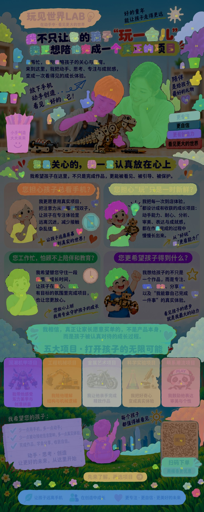

# poster-to-layered-psd

把**压平的成品海报**（JPG/PNG）逆向拆成可编辑物料：矢量 SVG、AI 兼容 PDF、分层 PSD 源文件。

已端到端验证：3150×7874 营销长图 → 75MB 矢量 SVG（文字无限放大锐利）+ 129 层 PSD（合成与原图逐像素一致，diff=0），二维码矢量化后实测解码一致。

## 效果预览

| 原始海报 | SAM 元素拆解（120+ 独立层） | 矢量化标题 2 倍放大 |
|---|---|---|
|  |  |  |

## 安装

```bash
pip install -r requirements.txt   # A-C档；D档需另装 torch + segment-anything
```

## 按需求选深度（可停在任一档）

| 档位 | 交付 | 依赖 | 耗时 |
|---|---|---|---|
| **A 只要能放大** | 矢量 SVG | vtracer | ~2 分钟 |
| B 要进 Illustrator | + PDF | + librsvg | +1 分钟 |
| C 要 PSD 改图 | + 分层 PSD | + psd-tools, opencv | +2 分钟 |
| D 每个元素单独一层 | + SAM 元素层 | + torch, segment-anything | ~30 分钟 |
| E 文字可编辑 | + 透明可编辑文字层 SVG | + OCR（macOS Vision 或 PaddleOCR） | +2 分钟 |

**平台支持**：macOS 全流程已验证；Windows 除 OCR 换 PaddleOCR、librsvg 换 winget 安装外均一致（SAM 在 CUDA/CPU 上不需要 MPS 补丁）。详见 SKILL.md「Windows 适配」。

## 快速开始

```bash
pip install vtracer

# 最简：任意扁平 JPG/PNG → 矢量 SVG（零配置）
python scripts/vectorize_svg.py 输入.jpg 输出.svg
```

含真实照片的海报建议照片区分离嵌入（否则照片会糊成色块）：

```bash
python scripts/vectorize_svg.py 输入.jpg 输出.svg --photos photos.json
# photos.json: [{"box":[x1,y1,x2,y2], "fade":{"top":400,"bottom":110}, "name":"主照片"}]
```

转 AI 兼容 PDF：

```bash
brew install librsvg
rsvg-convert -f pdf 输出.svg -o 输出.pdf   # Illustrator 打开 → 另存为 .ai
```

分层 PSD / SAM 元素拆解：见 [SKILL.md](SKILL.md) 步骤 4-5（含 Apple Silicon MPS 必打补丁）。

## 这个仓库的真正价值：踩过的坑

脚本是薄封装，值钱的是这些端到端验证过的坑（SKILL.md 有完整细节）：

1. **libxml2 单属性 10MB 上限**：SVG 内嵌 base64 图片超限会被 rsvg 静默截断报 "Premature end of data"——必须切片嵌入
2. **segment-anything 在 Apple Silicon MPS 上开箱即崩**：float64 不支持 + 单 buffer ~17GB 上限 + torchvision NMS 设备混用，`scripts/patch_sam_mps.py` 一键打补丁（幂等）
3. **psd-tools 中文图层名乱码**：必须手写 `luni` Unicode tagged block，legacy 字段用 ASCII 占位
4. **cairosvg 在 macOS 找不到 brew 的 libcairo**（SIP 剥离 DYLD 变量）——直接用 rsvg-convert
5. **照片区羽化嵌入法**：同内容的矢量↔位图渐变过渡，无接缝
6. **验收硬指标**：PSD composite 与原图逐像素 diff 必须为 0；二维码矢量化后必须重新解码比对

## 局限（如实说明）

- PSD 文字层是从成稿抠出的**位图**，不是可打字编辑的文本层
- 色彩法只抠指定主色文字；SAM 元素层含蒙版内部背景，发丝级边缘需人工 defringe
- 照片层本身是位图不能再放大
- 自动拆解是"设计师起点"，不是免修成品

## 作为 Agent Skill 使用

本仓库同时是一个标准的 Agent Skill（SKILL.md + scripts/），解压到以下任一目录即可被对应 agent 自动发现：

- Hermes: `~/.hermes/skills/`
- Claude Code: `~/.claude/skills/`
- Codex: `~/.codex/skills/`

## License

MIT
